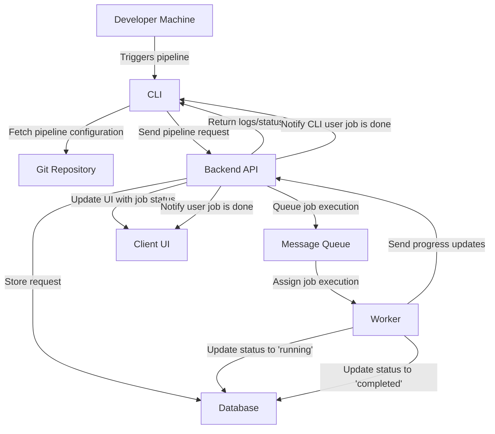
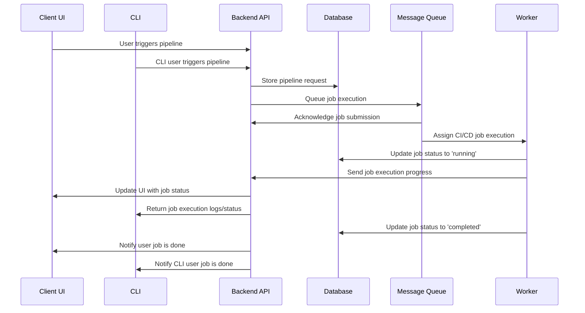

# 25Spring CS6510 Team 1 - CI/CD System
- **Title:** High Level Architecture design file
- **Date:** Jan 31, 2025
- **Author:** Yiwen Wang, Mingtianfang Li
- **Version:** 1.0

**Revision History**
|Date|Version|Description|Author|
|:----:|:----:|:----:|:----:|
|Jan 31, 2025|1.0|Initial release| Yiwen Wang, Mingtianfang Li|

# Design Proposal

## System Components

### Developer Machines  
- Workstations where developers trigger the pipeline execution via the CLI tool.

### Git Repository (Local & Remote)  
- Stores and manages pipeline configurations in `.pipelines/`.  
- The CLI interacts with these repositories to fetch the necessary configuration files.

### CI/CD Pipeline Runner (CLI)  
- The primary interface for developers to execute and manage CI/CD pipelines.  
- Sends pipeline execution requests to the backend.

### Configuration Validation Service  
- Reads, validates, and ensures correctness of `.yaml` pipeline configurations.  
- Runs as a service to provide real-time validation feedback.

### Execution Engine  
- Orchestrates and runs jobs based on defined dependencies.  
- Supports both parallel and sequential execution.

### Error Monitoring Service  
- Captures syntax errors, missing dependencies, and execution failures.  
- Provides error logs and notifications to the CLI.

### Logging & Reporting Service  
- Stores execution logs and historical pipeline runs.  
- Provides reports and analytics on past executions.

## Workflow

1. Developers trigger the pipeline using the CLI.
2. The system reads pipeline configurations stored in the `.pipelines/` directory.
3. The YAML parser validates the configuration.
4. The execution engine runs jobs in parallel or sequentially based on dependencies.
5. Error handling and logging modules provide feedback.
6. Reports are stored and accessible via the CLI.

## Diagram

### Explanation:
- The **developer** triggers the pipeline using the **CLI**.
- The **CLI** fetches pipeline configurations from the **Git repository**.
- The **Backend API** stores requests in a **Database** and queues execution via a **Message Queue**.
- A **Worker** picks up the job, updates its status, and reports progress.
- The **Backend API** updates the **UI** and **CLI** with logs and final job completion status.

### High Level Diagram

### Sequence Diagram

