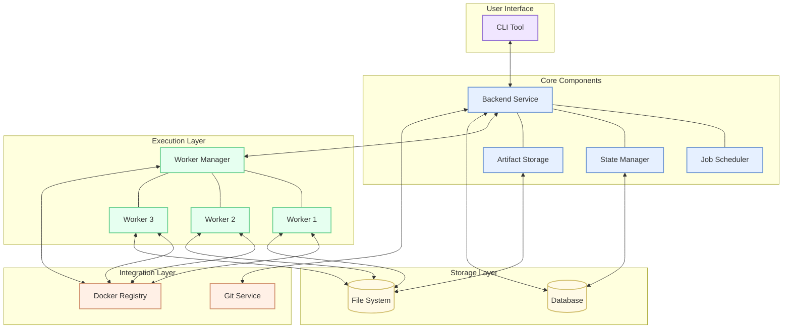
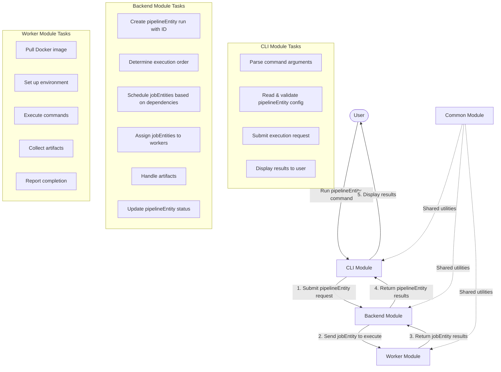
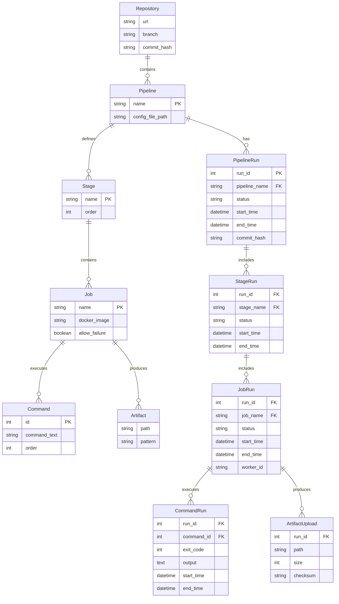

# CI/CD System Design Document

This document provides a high-level overview of the custom CI/CD system design, including the system architecture, component interactions, data model, and execution flow.

## Table of Contents

1. [System Overview](#system-overview)
2. [High-Level Architecture](#high-level-architecture)
3. [Module Structure](#module-structure)
4. [Execution Flow](#execution-flow)
5. [Entity-Relationship Model](#entity-relationship-model)
6. [Local vs. Remote Execution](#local-vs-remote-execution)

## System Overview

The custom CI/CD system allows developers to define and run pipelines both locally on their development machines and remotely on the company's data centers. The system supports:

- Pipeline configuration in YAML files stored in the repository
- Pipeline execution based on Git repositories, branches, and commits
- Stage and jobEntity dependencies with parallel execution
- Docker-based jobEntity execution
- Artifact collection and storage
- Comprehensive reporting on pipelineEntity execution

## High-Level Architecture

The system is designed with a modular architecture that separates concerns and allows for both local and distributed execution:



### Components:

1. **User Interface Layer**
   - **CLI Tool**: Command-line interface for developers

2. **Core Components**
   - **Backend Service**: Central orchestration component
   - **Job Scheduler**: Handles jobEntity scheduling based on dependencies
   - **State Manager**: Tracks pipelineEntity, stageEntity, and jobEntity states
   - **Artifact Storage**: Manages storage and retrieval of artifacts

3. **Execution Layer**
   - **Worker Manager**: Coordinates jobEntity distribution
   - **Workers**: Execute jobEntities in Docker containers

4. **Storage Layer**
   - **Database**: Stores configurations, history, and metadata
   - **File System**: Stores artifacts and large binary data

5. **Integration Layer**
   - **Git Service**: Interacts with Git repositories
   - **Docker Registry**: Provides Docker images for execution

## Module Structure

The system is divided into four primary modules:

1. **CLI Module**
   - Handles user interaction via command-line interface
   - Validates pipelineEntity configurations
   - Submits execution requests to the backend
   - Displays results and reports to users

2. **Backend Module**
   - Creates and manages pipelineEntity runs
   - Determines execution order based on dependencies
   - Assigns jobEntities to workers
   - Tracks pipelineEntity state and history
   - Manages artifact storage

3. **Worker Module**
   - Pulls Docker images and creates containers
   - Executes jobEntity commands in isolated environments
   - Collects output, status, and artifacts
   - Reports results back to the backend

4. **Common Module**
   - Provides shared utilities and models used across modules
   - Handles configuration parsing and validation
   - Implements Git operations
   - Defines data structures for system-wide use

### Why Separate Worker and Backend?

The separation between worker and backend components provides several benefits:

1. **Scalability**: Workers can be deployed on multiple machines to handle parallel jobEntity execution
2. **Resource isolation**: Jobs with different resource requirements can run on specialized workers
3. **Fault tolerance**: If a worker fails, only the jobEntities on that worker are affected
4. **Security**: Workers can run in isolated environments with limited permissions

## Execution Flow

The execution flow of the CI/CD system involves interaction between all components:



1. **User Interaction**:
   - User initiates a pipelineEntity run through the CLI
   - Example: `xx run --pipelineEntity my-pipelineEntity`

2. **CLI Processing**:
   - Parses command arguments
   - Reads and validates the pipelineEntity configuration
   - Submits the execution request to the Backend

3. **Backend Processing**:
   - Creates a pipelineEntity run with a unique ID
   - Determines execution order based on stageEntities and dependencies
   - Schedules and assigns jobEntities to Workers
   - Monitors jobEntity status
   - Handles artifact management
   - Updates overall pipelineEntity status

4. **Worker Execution**:
   - Receives jobEntity execution requests
   - Pulls required Docker images
   - Sets up the execution environment
   - Runs the commands specified in the jobEntity
   - Captures output and status
   - Collects artifacts when successful
   - Reports completion back to the Backend

5. **Result Reporting**:
   - Backend compiles the pipelineEntity execution results
   - CLI displays results to the user

## Entity-Relationship Model

The data model for the CI/CD system consists of configuration entities and execution entities:



### Configuration Entities

1. **Repository**:
   - Contains metadata about the Git repository
   - URL, branch, and commit hash

2. **Pipeline**:
   - Represents a CI/CD pipelineEntity configuration
   - Has a unique name and a path to its config file

3. **Stage**:
   - Represents a phase in the pipelineEntity (build, test, deploy, etc.)
   - Has an order defining sequence of execution

4. **Job**:
   - Represents a specific task to be executed
   - Has a name, Docker image, and can allow failure

5. **Command**:
   - Individual shell commands to be executed
   - Each jobEntity can have multiple commands executed in sequence

6. **Artifact**:
   - Files or directories produced by jobEntities
   - Defined by path and pattern specifications

### Execution Entities

7. **PipelineRun**:
   - An instance of a pipelineEntity execution
   - Tracks status, start/end times, and specific commit

8. **StageRun**:
   - An instance of a stageEntity execution
   - Tracks status and execution times

9. **JobRun**:
   - An instance of a jobEntity execution
   - Includes status, times, and the worker that executed it

10. **CommandRun**:
   - An instance of a command execution
   - Captures exit code, output, and execution times

11. **ArtifactUpload**:
   - Records of artifacts uploaded by jobEntities
   - Includes path, size, and verification data

## Local vs. Remote Execution

The system supports both local and remote execution modes:

### Local Execution

- All components run on the developer's machine
- Helpful for testing and debugging pipelines
- Pipeline runs and results are stored locally
- Initiated with the `--local` flag: `xx run --local --pipelineEntity my-pipelineEntity`

### Remote Execution

- Components are distributed across server infrastructure
- Provides more computing resources for larger workloads
- Results are accessible to the entire team
- Default mode: `xx run --pipelineEntity my-pipelineEntity`

The same CLI and configuration files work in both modes, allowing developers to test locally before pushing changes for remote execution.

## Project Structure

The CI/CD system is organized into a modular, clean architecture with clear separation of concerns. Here's the recommended project structure:

```
cicd-system/
├── cli/                      # CLI Module
│   ├── src/
│   │   ├── main/
│   │   │   ├── java/
│   │   │   │   └── com/
│   │   │   │       └── company/
│   │   │   │           └── cicd/
│   │   │   │               └── cli/
│   │   │   │                   ├── CicdCli.java            # Main CLI entry point
│   │   │   │                   ├── commands/               # Command implementations
│   │   │   │                   │   ├── RunCommand.java
│   │   │   │                   │   ├── CheckCommand.java
│   │   │   │                   │   ├── ReportCommand.java
│   │   │   │                   │   └── DryRunCommand.java
│   │   │   │                   ├── options/                # CLI option definitions
│   │   │   │                   │   ├── GlobalOptions.java
│   │   │   │                   │   └── RunOptions.java
│   │   │   │                   └── output/                 # Output formatters
│   │   │   │                       ├── ConsoleFormatter.java
│   │   │   │                       ├── JsonFormatter.java
│   │   │   │                       └── YamlFormatter.java
│   │   │   └── resources/
│   │   └── test/
│   └── pom.xml                # CLI module dependencies
│
├── backend/                   # Backend Module
│   ├── src/
│   │   ├── main/
│   │   │   ├── java/
│   │   │   │   └── com/
│   │   │   │       └── company/
│   │   │   │           └── cicd/
│   │   │   │               └── backend/
│   │   │   │                   ├── BackendService.java     # Main service entry point
│   │   │   │                   ├── pipelineEntity/               # Pipeline management
│   │   │   │                   │   ├── PipelineManager.java
│   │   │   │                   │   └── PipelineRepository.java
│   │   │   │                   ├── scheduler/              # Job scheduling
│   │   │   │                   │   ├── JobScheduler.java
│   │   │   │                   │   └── DependencyResolver.java
│   │   │   │                   ├── state/                  # State management
│   │   │   │                   │   ├── StateManager.java
│   │   │   │                   │   └── RunRepository.java
│   │   │   │                   └── artifacts/              # Artifact management
│   │   │   │                       ├── ArtifactManager.java
│   │   │   │                       └── ArtifactRepository.java
│   │   │   └── resources/
│   │   └── test/
│   └── pom.xml                # Backend module dependencies
│
├── worker/                    # Worker Module
│   ├── src/
│   │   ├── main/
│   │   │   ├── java/
│   │   │   │   └── com/
│   │   │   │       └── company/
│   │   │   │           └── cicd/
│   │   │   │               └── worker/
│   │   │   │                   ├── WorkerService.java      # Main worker entry point
│   │   │   │                   ├── docker/                 # Docker interaction
│   │   │   │                   │   ├── DockerClient.java
│   │   │   │                   │   └── ImageManager.java
│   │   │   │                   ├── executor/               # Job execution
│   │   │   │                   │   ├── JobExecutor.java
│   │   │   │                   │   └── CommandRunner.java
│   │   │   │                   └── artifacts/              # Artifact collection
│   │   │   │                       ├── ArtifactCollector.java
│   │   │   │                       └── PathMatcher.java
│   │   │   └── resources/
│   │   └── test/
│   └── pom.xml                # Worker module dependencies
│
├── common/                    # Common Module
│   ├── src/
│   │   ├── main/
│   │   │   ├── java/
│   │   │   │   └── com/
│   │   │   │       └── company/
│   │   │   │           └── cicd/
│   │   │   │               └── common/
│   │   │   │                   ├── config/                 # Configuration handling
│   │   │   │                   │   ├── ConfigLoader.java
│   │   │   │                   │   ├── ConfigValidator.java
│   │   │   │                   │   └── YamlParser.java
│   │   │   │                   ├── model/                  # Shared data models
│   │   │   │                   │   ├── pipelineEntity/
│   │   │   │                   │   │   ├── Pipeline.java
│   │   │   │                   │   │   ├── Stage.java
│   │   │   │                   │   │   └── Job.java
│   │   │   │                   │   └── execution/
│   │   │   │                   │       ├── PipelineRun.java
│   │   │   │                   │       ├── StageRun.java
│   │   │   │                   │       └── JobRun.java
│   │   │   │                   ├── git/                    # Git operations
│   │   │   │                   │   ├── GitClient.java
│   │   │   │                   │   └── RepositoryUtils.java
│   │   │   │                   └── utils/                  # Shared utilities
│   │   │   │                       ├── FileUtils.java
│   │   │   │                       └── ValidationUtils.java
│   │   │   └── resources/
│   │   └── test/
│   └── pom.xml                # Common module dependencies
│
└── pom.xml                    # Parent POM file
```

### File and Package Naming Conventions

1. **Package Names**:
   - Use reverse domain notation: `com.company.cicd`
   - Module-specific packages: `com.company.cicd.<module>`
   - Feature-specific subpackages: `com.company.cicd.<module>.<feature>`

2. **Class Names**:
   - Use `PascalCase` for class names: `PipelineManager`, `GitClient`
   - Group related functionality in descriptive packages
   - Use suffixes to indicate role:
      - `*Service`: Entry points for services
      - `*Manager`: Components managing resources
      - `*Repository`: Data access components
      - `*Utils`: Utility classes
      - `*Command`: CLI command implementations

3. **Interface Names**:
   - Prefix with `I` or name by capability: `IJobExecutor` or `JobExecutor` (interface) vs `DefaultJobExecutor` (implementation)

4. **File Organization**:
   - One primary class per file
   - Place tests in matching package structure under `src/test`
   - Group related classes in logical packages

This structure provides a clean separation of concerns while making it easy to understand the purpose of each module, package, and class in the system.