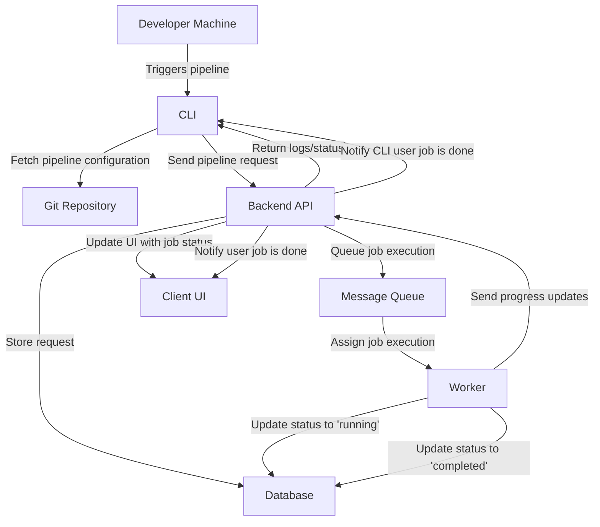
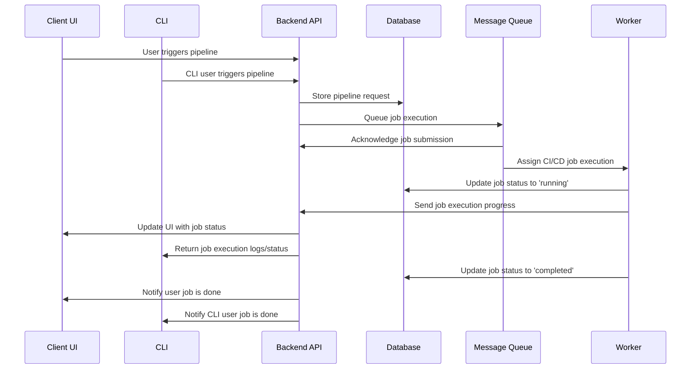

# 25Spring CS6510 Team 1 - CI/CD System
- **Title:** High Level Architecture design file
- **Date:** Jan 31, 2025
- **Author:** Yiwen Wang, Mingtianfang Li
- **Version:** 1.0

**Revision History**
|Date|Version|Description|Author|
|:----:|:----:|:----:|:----:|
|Jan 31, 2025|1.0|Initial release| Yiwen Wang, Mingtianfang Li|

# Design Proposal

## System Components

- **Developer Machines** - A developer triggers the pipeline execution using the CLI.
- **Git Repository (Local & Remote)** - The CLI interacts with the repository to fetch pipeline configurations stored in `.pipelines/`.
- **CI/CD Pipeline Runner (CLI)** - Acts as the main interface for executing and managing pipelines.
- **Configuration & YAML Parser** - Reads and validates the `.yaml` pipeline configurations.
- **Execution Engine** - Runs jobs in parallel or sequentially based on dependencies.
- **Error Reporting Module** - Captures syntax errors, missing dependencies, and execution failures.
- **Logging & Reporting Module** - Stores execution logs and provides reports on past executions.

## Workflow

1. Developers trigger the pipeline using the CLI.
2. The system reads pipeline configurations stored in the `.pipelines/` directory.
3. The YAML parser validates the configuration.
4. The execution engine runs jobs in parallel or sequentially based on dependencies.
5. Error handling and logging modules provide feedback.
6. Reports are stored and accessible via the CLI.

## Diagram

### Explanation:
- The **developer** triggers the pipeline using the **CLI**.
- The **CLI** fetches pipeline configurations from the **Git repository**.
- The **Backend API** stores requests in a **Database** and queues execution via a **Message Queue**.
- A **Worker** picks up the job, updates its status, and reports progress.
- The **Backend API** updates the **UI** and **CLI** with logs and final job completion status.

### High Level Diagram

### Sequence Diagram

